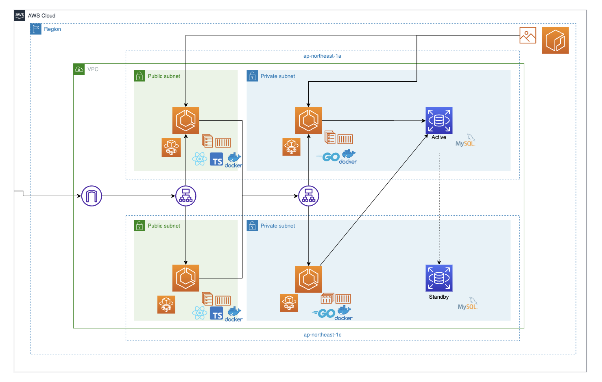

 

## サービスへの想い

私が現在在学している大学では、部屋をゼミやオンライン面接で利用する際に事務を通して予約します。
しかし、勝手に利用する方がいてブッキングしたり、利用状況の確認のために逐一事務に足を運ばなくてはならず、事務の方もユーザー（ここでは教員と生徒）も大変だと感じました。
そこで人を通さずに予約、確認できるシステムを作りたいと思い、このサービスを開発しました。
また、研究室の後輩にも開発に参加してもらい、実際の開発の体験を積んでもらうという側面も併せ持っています

 

## 作成期間
Gplang、React、Docker、AWSの学習&開発
### 2ヶ月
 

## 機能一覧
- ログイン機能（JWT）
    - JWTを活用した認証機能
    - CORSの対策

- 部屋情報のCRUD
    - 部屋の予約状況を確認できる機能
    - 部屋の予約を行う機能
    - 部屋の予約をキャンセルする機能

 

## 使用技術

 

## こだわったポイント
- バックエンドはGolangを使用し、CleanArchitectureを意識した実装を行った。
    - 実際に開発に参加したい後輩とチーム開発を想定しているため、機能の追加削除のしやすい構成にした。
- JWTを用いた認証機能を実装した。
- チーム開発を想定
    - Github Projectsを活用しタスク管理を行った。
    - TecBowl社の学習サービスであるTechtrain[https://lp.techtrain.dev/]を活用し、プロのエンジニアの方からコードレビューをいただいた

 

## 今後取り組んでいきたいポイント
- バックエンドのテスト実装（CleanArchitectureの良さを活かすため）
- Reactなどのフロントは時間をあまり避けなかったので、今後アップデートしたい
- GithubActionを活用したCI/CD化
- Teraformなどを活用したIaC化

 

| Category          | Technology Stack                                     |
| ----------------- | --------------------------------------------------   |
| Frontend          | TypeScript, React                       |
| Backend           | Golang, echo, gorm                           |
| Infrastructure    | Amazon Web Services                          |
| Database          | MySQL                                           |
| Environment setup | Docker                                               |
| etc.              | Postman, Git, GitHub |

 

## システム構成図

 

## ER図

 

## 今後の展望

今後は、
- サーバーサイド開発に興味を持っている研究室の後輩1名
- フロント開発に興味を持っている研究室の後輩1名
を新たなに加え、計3名で共同開発を続けていく予定です。
現在はフェーズ1として、基本的な機能実装、取り急ぎデプロイまで行っております。
将来的に実際の現場である弊学での稼働を目指しています。  

- フェーズ1：基本的な機能を実装し、デプロイする。
- フェーズ2：Time Tableを作成して、予約時間を時間割内に限定する。
- フェーズ3：カレンダーと同期できるようにし、予約形態を変更する。
- フェーズ4：メール通知やLINE通知などの外部サービスとの連携を行う。

またユーザーヒアリングを適宜実施し、機能改善等にも取り組んでいきます。
